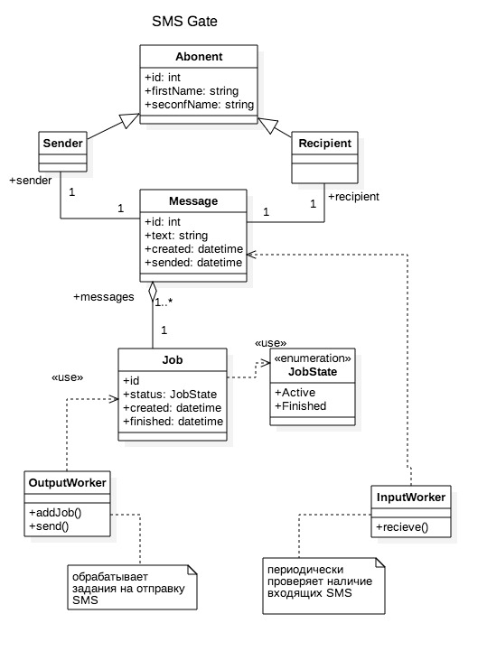

SMS Gate
========

Проект создан при прохождении курса от Mail.Ru Group [Углубленное программирование на C/C++](https://stepik.org/course/%D0%A3%D0%B3%D0%BB%D1%83%D0%B1%D0%BB%D0%B5%D0%BD%D0%BD%D0%BE%D0%B5-%D0%BF%D1%80%D0%BE%D0%B3%D1%80%D0%B0%D0%BC%D0%BC%D0%B8%D1%80%D0%BE%D0%B2%D0%B0%D0%BD%D0%B8%D0%B5-%D0%BD%D0%B0-CC++-153) на [Stepic.org](https://stepik.org).

Особенности и задачи:

1. Замена для сервисов отправки СМС. Web сервис позволяющий отправить СМС на базе RaspberryPi или аналога.

2. Непосредственно для работы с модемом используем пакет smstools.

3. Web интерфейс позволяющий отправить СМС через REST API с минимальной авторизацией или без нее.

3. Простейшая веб админка для просмотра отправленных и принятых СМС.

Send SMS через USBmodem
-----------------------

Для отправки используем GSM модем и пакет smstools.

[Отправка SMS с 3G/GSM модема](https://habrahabr.ru/post/133085/)
[Управляем сервером посредством СМС](https://habrahabr.ru/post/114912/)

Админка
-------

Планировал прицепить админку на базе Node.js, в рамках курса попробую сделать это дело на С++.

Встраиваемый [HTTP server mongoose](https://github.com/cesanta/mongoose).

UML
---

Вторая диаграмма нарисована в [draw.io](https://www.draw.io/):

Первая диаграмма нарисована в [StarUML](http://staruml.io/) - **SMSGate_Domain_Model_step1.mdi**:

Дополнительные библиотеки
-------------------------

1. Test framework [google test](https://github.com/google/googletest)

2. Command line parser [boost::program_options](http://www.boost.org/doc/libs/1_61_0/doc/html/program_options.html)

3. Small, safe and fast formatting library [fmt](http://fmtlib.net/latest/index.html)

4. Very fast, header only, C++ logging library [spdlog](https://github.com/gabime/spdlog)

5. Embedded Web Server [mongoose](https://github.com/cesanta/mongoose)

6. Планируется [JSON for Modern C++](https://github.com/nlohmann/json)

